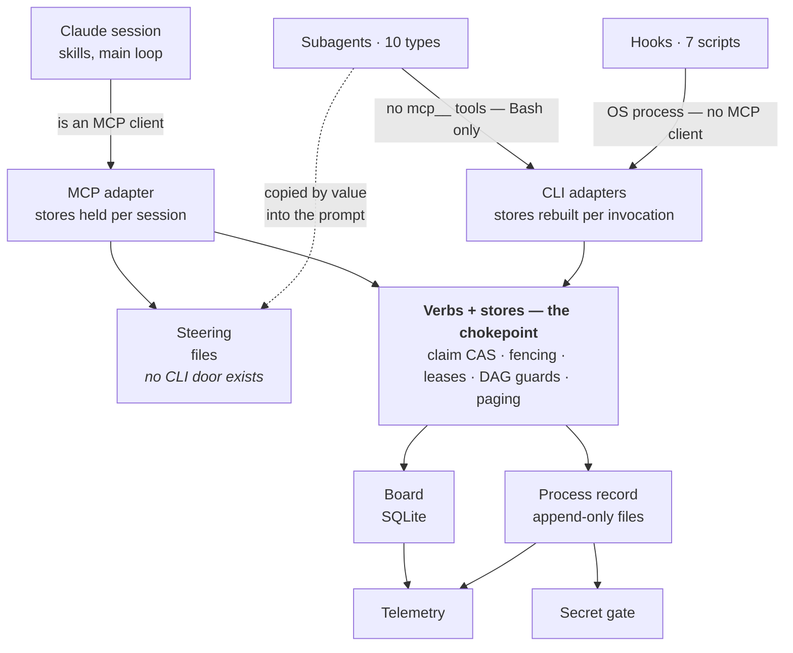
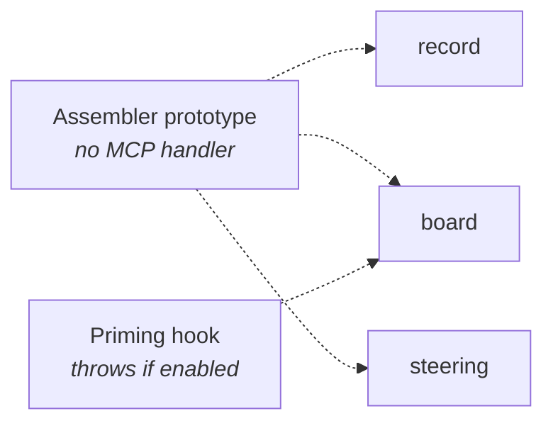

# Ideate v3 — architecture inventory, part 0: overview

*What the shipped MVP actually is, stated from the code (cross-module import
census + reading each crossing), 2026-08-03. This set of docs is the input
to the alignment session that decides what the stage-3 eval harness measures.*

## The one-paragraph version

Ideate v3 is a Claude Code plugin that gives an agentic project a **memory it
can converge against**: an append-only **process record** (why things were
decided), a **delegation board** (what work exists, who holds it, what's
done), and a **steering store** (the principles and policies that govern the
work). Callers reach the stores through an MCP server (one process per Claude
session) or per-invocation CLIs, over the same on-disk files — not a choice
between equals, but because hooks are OS processes and subagents are granted
no MCP tools, so the CLI is the only door either one can speak. A third
function from the
ratified frame, the **knowledge graph**, is scheduled post-MVP and exists
today only as the record store's typed references and a gated-off prototype
assembler (GP-23: no intelligence machinery before the instrument that
measures it).

## Component map

The doors are **not** alternative routes for the same caller. Each caller has
exactly one it is *capable* of speaking, and the shape of the diagram is a
consequence of the host, not a design preference:

The gated layer sits beside all of this, wired to nothing (GP-23):

Three access patterns, not two: MCP for the session, the CLIs for every
caller that runs as a *process* rather than inside the session, and — for
steering, which has no CLI door at all — **copy-by-prompt**, where the
invoking skill reads steering over MCP and pastes it into the subagent's
prompt (`agents/domain-curator.md`). The third pattern is real, load-bearing,
and was invisible in earlier versions of this map.

## The three stores, one line each

| Store | On disk | Mutation model | Why it's separate |
|---|---|---|---|
| **Process record** | Markdown files, one per record | Append-only; corrections are new records that *supersede* | The audit trail. Files = no version handshake = survives outages (conway) |
| **Delegation board** | `board.db` (SQLite) | Highly mutable, transactional: claim CAS, fencing tokens, leases | Coordination state. Compare-and-set needs a real database |
| **Steering** | Files (YAML-frontmatter items) | Mutable, MCP-only writes, amendment history kept | Governance cadence: amended rarely, read every session |

## What "thin seam" means here, mechanically

A census of the shipped source's cross-module imports shows the coupling is
exactly as narrow as the frame claims:

- The stores **never import each other** — with two named exceptions, both
  the same *shape*: a small purpose-built bridge appending one kind of board
  event to the process record (`completion-record.ts`, `migration-signal.ts`).
  This is the named **bridge pattern**: board events that matter to the
  process record cross via a bridge module, never via the stores knowing
  each other.
- One module, `transport/id-resolver.ts`, is allowed to know *both* the
  record and the board — it answers "which store does this id belong to."
  That is its entire job.
- Everything else that looks like a cross-seam import is `record/id.js`
  (the `Clock` type and ULID generator) — a shared kernel living inside
  `record/` by accident of history. Named here so future censuses don't
  re-explain it.

## The transports are a designed fault line

The CLI builds a fresh store per invocation; the MCP server holds one for
the session. Any behavior whose mechanism depends on process lifetime
reaches exactly one of them — the split produced four defects in one arc
before it got an explicit contract (`docs/transport-contract.md`): a
two-question invariant (staleness of cross-call state; discovery across both
transports' consumers) plus a cross-transport parity test.

The chokepoint that limits the blast radius is **one layer below the
transports**, and it is real: both adapters do the same three lines —
`loadConfig` → `new WorkStateStore` → `new WorkStateVerbs` — and then call
`ctx.verbs.<verb>`. No claim CAS, fencing rule, lease policy, or DAG guard is
written twice (`cli/ideate-work.ts:243`, `work-state/tools.ts:335`).

What is *not* enforced is the adapters' thinness. Each one independently
decides which optional seams to wire, and they have already diverged — see
`04-transports-and-infra.md` for the two verified cases. The fault line is
governed; the **surface** is not.

## The mechanical-enforcement layer is part of the architecture

Ideate's conventions are held by *tests that scan the shipped tree*, not by
discipline: census tests derive their registries by scanning `skills/`,
`agents/`, `docs/` at test time (a new prose surface auto-enters and fails
until it complies or carries a reasoned exemption); parity tests run the
real CLI binary against real stores; mutation-testing is the stated standard
(P-41) for any guard. This layer is why "lightweight docs" can stay
lightweight — the load-bearing invariants live in executable checks, and
these docs point at them rather than paraphrase them.

## Where the rest of this set goes

- `01-process-record.md` — how the record stores and serves data
- `02-delegation-board.md` — the board's storage, claim lifecycle, migrations
- `03-steering.md` — the steering store and its consumption
- `04-transports-and-infra.md` — the two doors, hooks, telemetry, guards
- `05-usage-audit.md` — **the audit**: what each data area is *for*, who
  actually reads it, what's working, what isn't, and the improvement list —
  the direct input to the alignment session.
