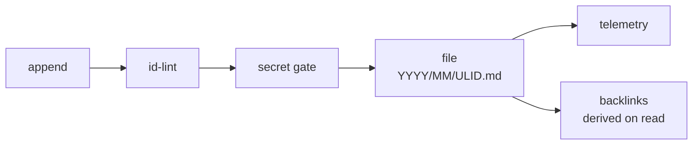
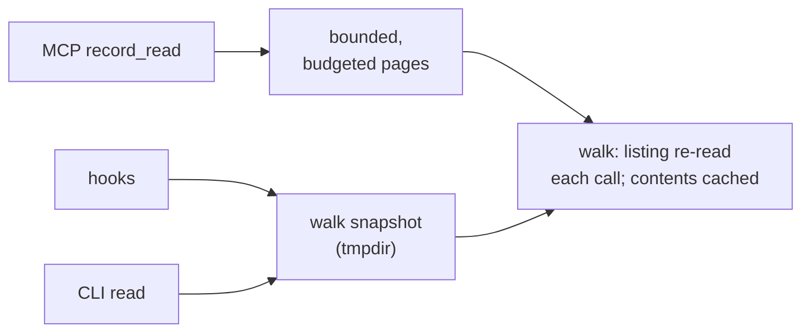

# Ideate v3 — architecture inventory, part 1: the process record

*The append-only store of why: decisions, findings, completions, journal
entries. Source of truth: `src/record/` (store.ts, read-page.ts, tools.ts),
`src/cli/ideate-record.ts`, `src/cli/record-walk-snapshot.ts`.*

## Storage

One Markdown file per record — YAML frontmatter (id, kind, claim, scope,
source, references) plus a prose body — with a ULID filename stem,
date-sharded as `record.path/YYYY/MM/{id}.md`. The record path comes from
`.ideate.json` (default `.ideate/record/`).

Three properties do the load-bearing work:

- **Append-only, immutable.** No code path edits a record. A correction is a
  *new* record carrying a `supersedes` edge; the superseded record surfaces
  its replacement as a derived backlink on read. This is what makes the
  permanent content cache safe (below) and what made records survive the
  conway board outage untouched.
- **Files, not a database.** No version handshake, no migration, openable by
  anything that can read Markdown — including a human with `grep`. Layout is
  frozen by steering (GP-20).
- **Secret-gated writes.** Every append passes a secret-scanning gate
  (`secret-gate/`) before persisting; redactions are counted in telemetry.

## Retrieval — three shapes, one walk

- **Selection, never ranking.** `record_read` filters (by id, or a plain
  substring over scope/kind/source) and pages; it does not score. Ranking is
  the future assembler's job, not the store's.
- **Bounded by two budgets.** Every list page is capped by count *and* by a
  payload character budget, with keyset cursors — the fix for the 81KB
  single-line `work_list` overflow class.
- **Freshness is structural.** The directory listing is re-read on every
  call, so a record written by any other process (the CLI, another session)
  is visible on the very next read; only immutable file contents are cached.
  Cross-transport visibility is pinned by `transport-parity.test.ts`.
- **The CLI's O(N) walk problem** (a fresh store per invocation re-walked
  every record on every call) is solved by an ephemeral per-project snapshot
  under `os.tmpdir()`, keyed by store path + selection + a freshness token —
  a 2.00× measured speedup with a byte-identical envelope, falling back to a
  live bounded page on any staleness.

## Who actually reads it

| Consumer | Path | Shape |
|---|---|---|
| Session-start hook | CLI | 10 most recent records as a context digest |
| Subagent-start hook | CLI | same digest, delivered to every spawned agent |
| Skills (execute/review/refine/autopilot) | MCP `record_read` + CLI | scope-filtered and by-id reads |
| Pre-compact / session-end / commit / task hooks | CLI | **writes** — the capture floor |

## Scale today

The two dogfooding stores on this machine: the ideate repo's own store
(~3,100 records) and the plugin dev store (~1,800). Reads stay paged and
budgeted at this scale; the CLI snapshot keeps per-invocation cost flat.

## Known edges

- **No semantic search.** Retrieval is recency + substring selection only.
  The hybrid semantic-seed + PPR direction is parked, deliberately, behind
  GP-23's instrument.
- **`kind` is open vocabulary.** Disciplined by convention (decision,
  finding, work-completion, journal, …), not schema — cheap to write, and
  the reason "board-migration" could become a kind with zero code change.
