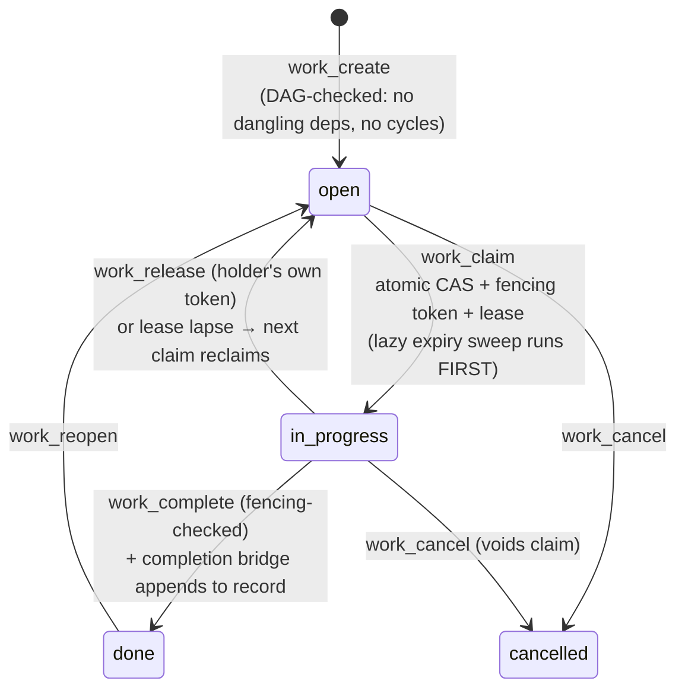

# Ideate v3 — architecture inventory, part 2: the delegation board

*The coordination state: what work exists, its dependencies, who holds it,
what's done. Source of truth: `src/work-state/` (schema.ts, store.ts,
claims.ts, expiry.ts, verbs.ts, tx.ts, dag.ts, tools.ts).*

## Storage

A single SQLite file (`board.db` under `.ideate-work/`), WAL mode with a
busy-timeout set on every connection by construction — two simultaneous
sessions writing one board is ordinary, not exceptional. Two tables:

- **`items`** — one row per work item: title, spec, status, `depends_on`
  (JSON), `parent_id` (containment), `"references"` (typed forward edges,
  e.g. supersedes), actor stamps, a version counter for optimistic CAS, and
  the five claim columns (holder, fencing token, lease).
- **`events`** — the append-only transition log. No code path may UPDATE or
  DELETE it (grep-falsifiable; pinned by test). Every claim, release,
  completion, cancellation, and expiry-reclaim lands here with actor and
  timestamp — the board's own audit trail.

Lazy-init: nothing on disk until the first write; reads against a
never-written board return empty without creating anything.

## The claim lifecycle — where the correctness lives

Three mechanisms carry the multi-agent guarantees:

1. **Fencing tokens.** Every claim mints a monotonically increasing token
   from a counter column (not derived from events, so it survives claim
   deletion). `complete`/`renew`/`release` reject a stale token — an agent
   whose lease lapsed and was reclaimed cannot clobber the new holder.
2. **Leases with lazy expiry.** Claims expire (default 4h); the expiry sweep
   runs lazily at the start of every id-scoped claim verb, as its own atomic
   transaction, and logs the reclaim to `events`.
3. **Optimistic CAS on metadata.** `work_update_meta` carries an expected
   version; dependency edits are DAG-checked (no dangling refs, no cycles,
   no self-ancestry) at write time.

## Schema versioning — the one-way door, now with a window

`PRAGMA user_version` stamps the schema version (currently 3); `PRAGMA
application_id` stamps a **compatibility floor** — the oldest binary
verified safe against the current schema. A newer board whose floor covers
this binary opens *degraded with a loud warning* instead of hard-refusing;
a board with no floor or a floor above this binary still throws
`SCHEMA_VERSION` — the refusal stays loud by design.

Two crossings, both made durable, not just loud:

- **Write-migration** (a newer binary migrates an older board forward).
  Announces on stderr at the moment it runs **and** fires a listener that
  appends a durable `board-migration` record to the project's process
  record (the conway incident had nothing pointing back at the crossing;
  now it would). Fires once per crossing.
- **Degraded open** (the mirror image: an OLDER binary opens a NEWER,
  floor-accepted board and runs with a partial view — anything the newer
  schema added is invisible to it). Also announces on stderr **and** fires
  a listener that appends a durable `board-degraded-open` record, naming
  this binary's schema version, the board's actual version, the stamped
  floor, and the board path. `checkSchemaVersion` runs on every
  `openForRead`/`openForWrite`, and the store opens a fresh connection per
  call — a degraded open is the steady state for an older binary against a
  given board, not a rare crossing, so durability here is per **condition**,
  not per call: the record appends on the first observation of a distinct
  (board path, board version, floor) tuple in the process and re-fires only
  when that tuple changes (a further migration on the same board, or a
  different board entirely) — record N would otherwise carry nothing record
  1 did not, since all three facts are fixed for the life of the process.
  The stderr line stays deduplicated to once per process, independently. The
  per-call occurrence count that the per-condition dedup no longer carries
  in the narrative record is tallied instead by the `board_degraded_opens`
  telemetry counter, which increments on every occurrence including the
  suppressed ones (mirroring the split the record store already makes
  between a redaction's process warning and its `redactions` counter).

Boards written before the floor existed self-heal the stamp on their next
write.

## Bridges to the process record (the named pattern)

Board events that matter to the process record cross via small purpose-built
bridge modules — the stores never import each other:

- `completion-record.ts` — `work_complete` appends a `work-completion`
  record (best-effort: record failure never blocks the completion, and is
  loud on stderr + telemetry).
- `migration-signal.ts` — the bridge for BOTH schema crossings: a
  write-migration appends a `board-migration` record, and a degraded open
  appends a `board-degraded-open` record, each through its own
  process-scoped listener registered by each transport. One bridge module,
  two listener factories — not a second bridge.

## Retrieval

List reads are **selection, never ranking**: filter by
tenant/status/parent, page to exhaustion with `next_cursor` until it is
`null`, bounded by both a count limit and a payload budget (same
`transport/` machinery as the record store). Claimability is computed over
the *whole* board, not the page, so paging can never hide a claimable item.
Every read opens a fresh connection — there is no cross-call cache to go
stale, which is why the board was immune to the record store's
transport-split correctness regression.

## Who actually uses it

The five skills (execute/review/refine/autopilot/init) drive it via MCP
tools; agent prompts and hooks reach it via the `ideate-work` CLI. The
read-side census of every prose surface that mentions the board read is
mechanically pinned (`board-paging-vocabulary.test.ts`) — the registry is
derived by scanning the shipped tree, so a new consumer auto-enters.

## Scale today

The ideate repo's own board: ~160 items, all but one done at the time of
writing; the events log spans the full history of every transition since
the board's creation.
