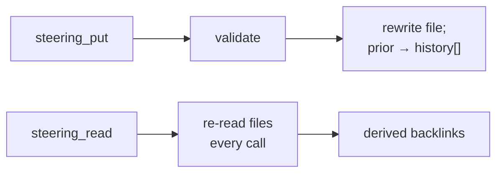

# Ideate v3 — architecture inventory, part 3: the steering store

*The governance layer: guiding principles (GP-*) and policies (P-*) that the
work is steered by. Source of truth: `src/steering/` (store.ts, tools.ts).*

## Why it exists in the frame

The ratified frame names three functions — process record, knowledge graph,
delegation board. Steering is the fourth, shipped and fundamental: it is
where the project's *rules about the work* live (eval-first, narrow seams,
mutation-proven tests, human-presentation), distinct from the record of what
happened and the board of what's being done. The frame's naming should say
"three functions + steering" — this store is not an implementation detail.

## Storage

One Markdown file per item under `.ideate/steering/` — quoted-YAML
frontmatter (id, kind, domain, status, amendment `history`) plus the
statement as prose body. ~105 items on this machine's ideate store (active +
deprecated + superseded; the active set is smaller).

Deliberately primitive: **read straight off the files — no index, no cache.**
Steering items are *mutable* (amendments are the whole point), so the record
store's "cache contents forever" strategy does not transfer — a steering
contents-cache would go stale the moment any process amends an item. Each
amendment appends the prior version to the item's `history`, so the
amendment trail is inside the file itself.

## Two properties worth naming

- **MCP-only writes.** There is no `ideate-steering` CLI bin — a deliberate
  single-transport write path, so the two-transport fault line (see
  `docs/transport-contract.md`) does not apply to writes at all. Reads
  happen through MCP tools and the in-process assembler path.
- **Gated per project** (`steering.enabled` in `.ideate.json`). The store
  tools are gated OFF by default (GP-23's naming discipline); the v2→v3
  migration enabled steering in all 18 migrated projects.

## Who actually reads it

| Consumer | How |
|---|---|
| refine / review / autopilot / init skills | `steering_read` (policies shape planning, review severity, curation) |
| domain-curator agent | proposes amendments; the invoking skill applies them via `steering_put` |
| review's steering-curation pass | `steering_put` amendments with history |
| This architecture review | GP-23, GP-26, P-40, P-41… are steering items, not folklore |

## The closed loop it's part of

Steering is how a *lesson* becomes a *rule with an audit trail*: an incident
(conway's lockout) → a finding → a decision → a policy amendment (P-40's
transport-parity clause) whose full history is in the file, greppable and
citable. The census/guard tests then cite the steering item they enforce
(P-48, P-52, P-41 appear verbatim in test headers) — so a principle's
*mechanism*, when one exists, is traceable from the item itself. GP-23's
mechanism is precisely what stage 3 exists to restore.
