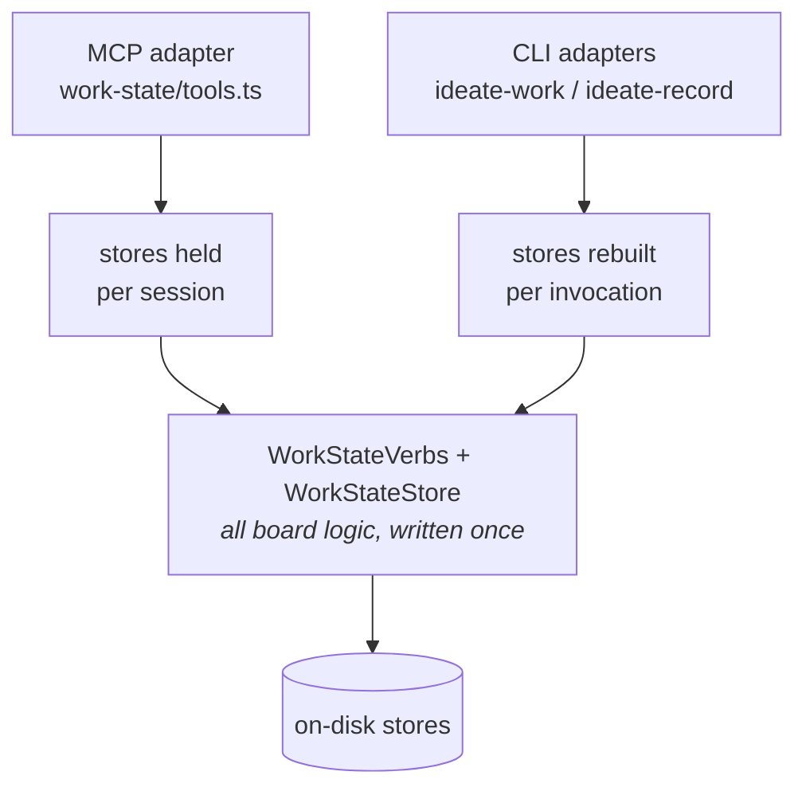

# Ideate v3 — architecture inventory, part 4: transports, hooks, and infrastructure

*Everything between the host and the stores, and everything beside them.
Source of truth: `src/cli/`, `src/server.ts`, `src/transport/`,
`src/telemetry/`, `src/secret-gate/`, `src/config/`, `hooks/`.*

## The two transports (one fault line, now governed)

### Why there are two doors at all

Not redundancy, and not a choice we can revisit by deleting one. The two
doors exist because the callers are not all the same kind of thing:

| Caller | Can it speak MCP? | Why |
|---|---|---|
| The Claude session (skills, main loop) | **Yes** | It *is* the MCP client |
| Hooks (`hooks/*.mjs`) | **No** | They are OS processes the host executes and reads stdout from. There is no MCP client in a hook |
| Subagents (all 10 in `agents/`) | **No** | Every agent's frontmatter grants `Read, Grep, Glob, Bash` (+ `Edit/Write` for worker, `WebSearch/WebFetch` for researcher). **Not one grants an `mcp__` tool** — an MCP connection belongs to the session and is not inherited by a spawned subagent |

So the CLI is the *only* door for two thirds of the caller population. Six of
the ten agents name the CLIs explicitly in their prompts. Removing the CLI
would not simplify the architecture; it would disconnect the hooks and every
subagent from the board and the record.

### Adapters over a shared core

Same stores, same envelopes, same budgets — different process lifetimes.
That difference is the fault line documented in `docs/transport-contract.md`
(two-question invariant: staleness of cross-call state; discovery across
both transports' consumers), guarded by `transport-parity.test.ts` (a real
CLI child process against a warm MCP-style store, both directions) and
steering rule P-40's transport-sibling clause.

### The surface has already drifted (two verified cases)

`cli/ideate-work.ts`'s own header claims "the eleven-verb surface, mirrored
here one subcommand per verb." Read against `work-state/tools.ts`, that is
not currently true. The *core* is shared; the *adapters* each decide
independently which arguments and optional seams to wire, and nothing checks
that they made the same decisions.

1. **Containment edges are unreachable from the CLI.** `parent_id` appears
   **zero times** in `cli/ideate-work.ts`. The MCP surface accepts it on both
   `work_create` and `work_update_meta` (set / move / clear-to-root, with the
   absent-vs-present-null distinction carefully preserved). Consequence: a
   subagent — which has no other door — cannot create or change the
   hierarchical containment edge, one of the board's two edge types and the
   thing `ideate:decomposer` exists to produce.
2. **Dangling reference ids fail silently on the CLI.** `verbs.updateMeta`
   takes an optional `onUnresolvedIds` callback (`work-state/verbs.ts:588`).
   MCP passes it at three sites — `work_create`, `work_update_meta`,
   `work_release` — and returns `unresolved_ids` in the envelope. The CLI
   passes it at none, so a typo'd `--supersedes <id>` is accepted with no
   warning on the one door subagents have. The id-lint that surfaces those
   ids was itself added by a correction (`work-state/tools.ts:417` cites
   finding `01KYV387QKRP3V330WAS6DX95K`) — and the fix landed on one door only.

3. **The CLI silently forks a new store when `cwd` is not the project root.**
   `loadConfig(projectRoot)` reads `<projectRoot>/.ideate.json` and, on
   `ENOENT`, *lazily creates it* (`config/ideate-config.ts:134`). There is no
   walk-up to find an enclosing project. The CLI passes `process.cwd()`
   (`cli/ideate-work.ts:324`), so running `ideate-record` from a subdirectory
   does not attach to the project's store — it silently onboards a **brand-new
   empty one** there. The MCP server has the same default
   (`work-state/tools.ts:338`) but is immune in practice: the host sets its
   cwd to the project dir once, at session start, and it never changes.
   The hooks are immune too, and deliberately — they pass `cwd: projectRoot`
   explicitly (`hooks/session-start.mjs:42`). Subagents are the exposed
   caller: nothing pins their working directory before a `Bash` CLI call.

   This is not hypothetical. Compiling *this document set* left a phantom
   store in `docs/architecture/` — `.ideate.json`, `.ideate-telemetry/`, and
   nine records under `.ideate/record/2026/08/` — written by census CLI runs
   that happened to have that directory as their cwd. Those nine records are
   invisible to the project they were meant for.

Neither of the first two is caught today, because `transport-parity.test.ts`
is three tests about **record-store freshness**
(`src/record/transport-parity.test.ts:101`).
It proves writes cross the process boundary. It says nothing about the board,
and nothing about whether the two doors expose the same verb surface.

### Steering has no CLI door — it is copied by prompt

There is no `ideate-steering` binary; `src/cli/` holds record, work, and a
snapshot utility, and no CLI file mentions steering. Steering reaches
subagents by **value**: the invoking skill reads it over MCP and pastes it
into the prompt (`agents/domain-curator.md` says so explicitly — "steering is
MCP-only for writes, but the skill hands you..."). That is a deliberate and
defensible choice for a store amended rarely and read every session, but it
is a third access pattern with its own costs (prompt bulk, and a snapshot
that cannot refresh mid-agent), and it belongs on the map rather than in the
gaps between the other two.

**Evaluated as two layers** (per the review's tech-debt finding):
`src/transport/` is (a) shared read-path utilities — payload budget, keyset
paging, id-lint — a *lower* layer both stores legitimately use; and (b)
`id-resolver.ts`, the one module allowed to know *both* the record and the
board — a *composition*-layer citizen. Both layers are working as intended
today; the naming doesn't say there are two, which is the debt.

## Hooks — the zero-cooperation capture floor

Seven host lifecycle hooks (`hooks/`, wired by `hooks.json`) make capture
happen without any skill remembering to do it:

| Hook | What it does |
|---|---|
| SessionStart | primes the session with the 10-most-recent record digest (CLI) + opportunistic board sweep |
| SubagentStart | delivers the same digest to every spawned subagent — primes *other frameworks'* workers too |
| PreCompact | captures session knowledge at the moment compaction would destroy it |
| SessionEnd | session-outcome record + board sweep |
| PostToolUse (git commit only) | commit-boundary record — the one completion signal every workflow emits |
| SubagentStop | delegated-work outcome records for any framework's subagents |
| TaskCompleted | completion analogue for Claude Code's native task list |

Design stance: hooks are the **floor** (always-on, bounded, cheap), skills
are the **rich path** (structured, deliberate). The digest is 10 records by
design — high-signal-minimal, not a firehose.

## Telemetry — collected, mostly unconsumed (audit flag)

Append-only NDJSON counters per project (`.ideate-telemetry/`). Eight
counter names exist; six have writers:

| Counter | Written by | Read by |
|---|---|---|
| `capture_fired`, `capture_write_failed`, `redactions` | record store, completion bridge | tests + the `ideate-telemetry` diagnostic bin |
| `work_claims` | priming hook (every claim — the future eval's denominator) | the report builder |
| `priming` | the `ideate-record` CLI's `prime` subcommand (`cli:prime`) | the report builder |
| `board_degraded_opens` | migration-signal.ts's degraded-open listener — every degraded open, including the ones the durable `board-degraded-open` process record de-dupes away | the report builder |
| `kg_unreachable`, `frontier_size` | **nothing — zero increment call sites** | the report parser only |

Nothing automated consumes the report: no hook, skill, agent, or doc calls
`ideate-telemetry`. This is the audit's clearest "data we have but don't
use" finding — kept deliberately cheap to collect, waiting on the stage-3
harness to say which signals matter. The two zero-caller counters are
leftovers of the retired usage surface / KG design and should be re-specced
from the new harness's requirements, not resurrected.

## The gated layer (GP-23's gate, held)

- `context/assemble-prototype.ts` — the budgeted, provenance-bearing
  briefing composer (structure-first seeding from board edges, density
  packing, per-source caps). Proves the three stores compose read-only. **No
  MCP handler, no wiring** — gated until the eval that measures it exists.
- `work-state/priming-hook.ts` — the seam in the claim path where priming
  will run. Flag off by default; flipping it throws `NOT_IMPLEMENTED`
  (caught, logged, swallowed — a claim can never fail because the flag was
  flipped early). Its only live effect is the `work_claims` counter.

## Config

`.ideate.json` per project (schema_versioned, honest-failure on a newer
file): record path, backend (`local` today, hosted later), work-state path,
steering enablement. `loadConfig` lazily onboards — first call creates the
file and record directory. The plugin's runtime floor is Node ≥22.5.0
(`node:sqlite`), pinned in `package.json` engines.
