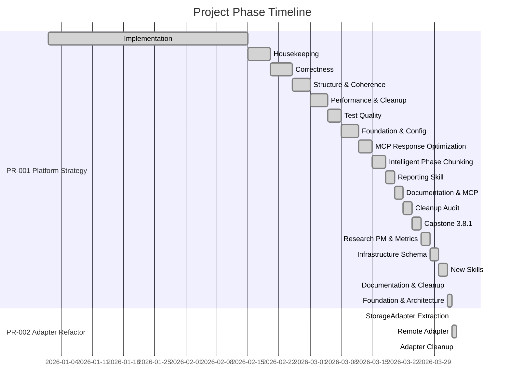
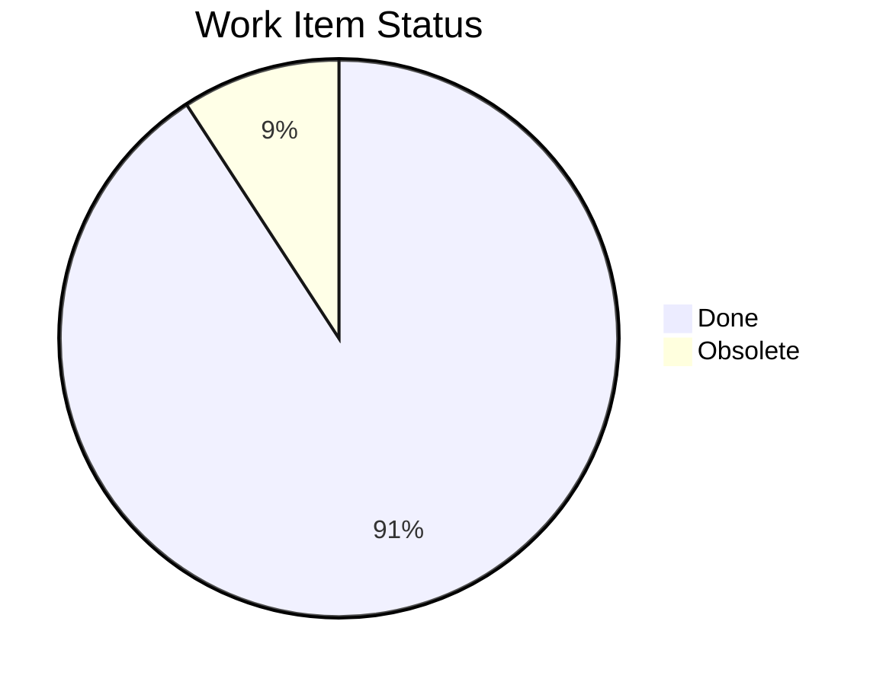
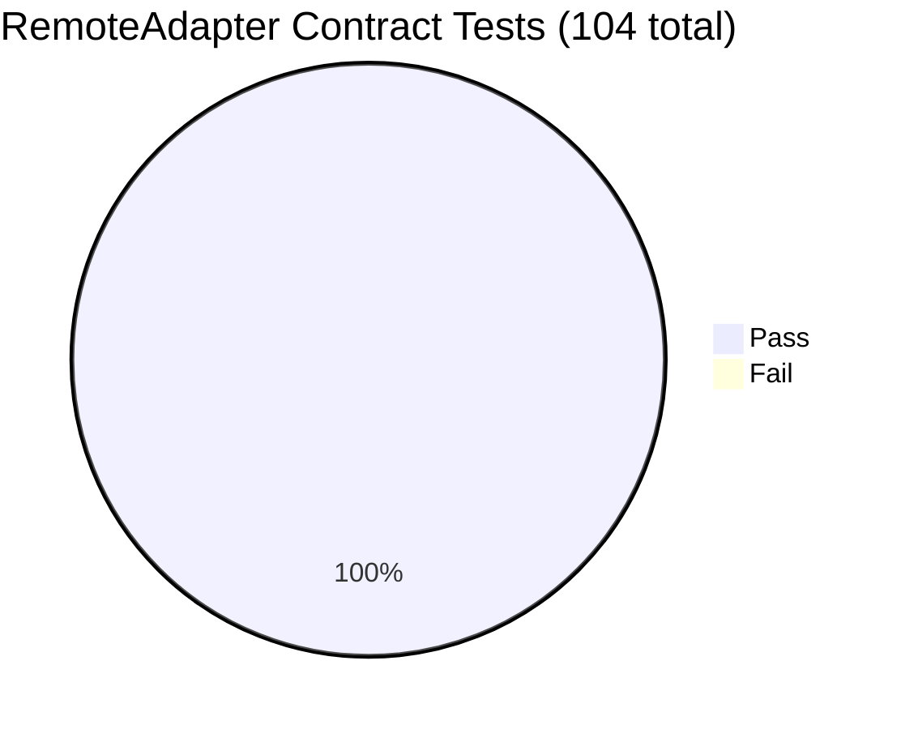
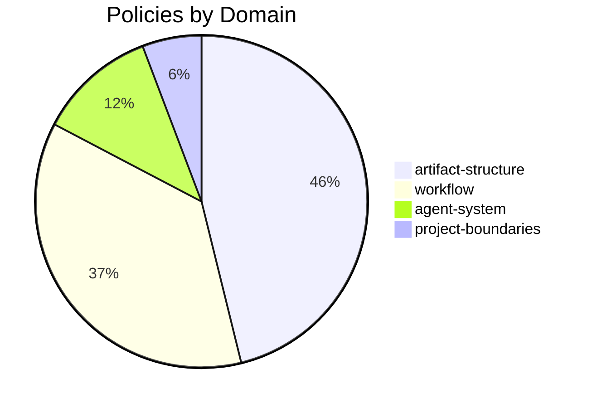

# Ideate Project Report

**Project**: Ideate Platform
**Generated**: 2026-04-03
**Projects**: PR-001 (Platform Strategy), PR-002 (Adapter Refactor)

---

## Executive Summary

Ideate has evolved from a Claude Code plugin to a platform-ready architecture with a pluggable storage backend. Two projects completed 21 phases and 455 work items. The MCP artifact server now routes through a StorageAdapter interface with both LocalAdapter (YAML+SQLite) and RemoteAdapter (GraphQL→Neo4j) implementations. The RemoteAdapter passes 104/104 contract tests against the running ideate-server. Platform specification documents, business setup checklist, and bootstrap guides are complete.

---

## Phase Timeline



| Phase | Type | Project | Status | Items |
|-------|------|---------|--------|-------|
| PH-001–PH-017 | Various | PR-001 | Complete | ~430 |
| PH-018 | Design | PR-001 | Complete | 17 |
| PH-019 | Implementation | PR-002 | Complete | 13 |
| PH-020 | Implementation | PR-002 | Complete | 4 |
| PH-021 | Implementation | PR-002 | Complete | 3 |

---

## Work Items



| Metric | Count |
|--------|-------|
| Total | 501 |
| Done | 455 |
| Pending | 0 |
| In Progress | 0 |
| Obsolete | 46 |
| Completion rate | 91% |

---

## PR-001: Platform Strategy — Deliverables

10 specification documents in `docs/platform/`:

| Document | Lines | Purpose |
|----------|-------|---------|
| steering.md | ~400 | Vision, taxonomy, architecture, roadmap |
| adapter-interface.md | ~680 | StorageAdapter TypeScript interface spec |
| architecture-overview.md | ~700 | System diagrams, refactoring plan |
| neo4j-schema.md | ~1050 | Neo4j labels, relationships, Cypher |
| graphql-schema.graphql | ~1350 | Complete GraphQL SDL |
| graphql-schema.md | ~720 | GraphQL design doc |
| migration-tool-spec.md | ~1250 | Migration/merge tool spec |
| business-setup-checklist.md | ~440 | LLC, domain, bank, services |
| bootstrap-ideate-server.md | ~530 | Server repo setup guide |
| bootstrap-ideate-infra.md | ~290 | Infra repo setup guide |

---

## PR-002: Adapter Refactor — Architecture

### Before
```
Tool Handler → YAML files + SQLite (interleaved)
```

### After
```
Tool Handler → StorageAdapter interface
                ├── LocalAdapter → YAML + SQLite
                └── RemoteAdapter → GraphQL → Neo4j
```

### Key Metrics
- **StorageAdapter interface**: 21 methods
- **LocalAdapter modules**: writer.ts, reader.ts, context.ts, index.ts
- **RemoteAdapter modules**: client.ts, index.ts
- **Contract tests**: 52 tests via factory pattern (reusable across adapters)
- **Total tests**: 692 pass (LocalAdapter), 104 pass (RemoteAdapter against server)
- **write.ts reduction**: 1289 → 334 lines

---

## Integration Test Results



| Category | Tests | Status |
|----------|-------|--------|
| Lifecycle | 3 | Pass |
| CRUD | 11 | Pass |
| Idempotency | 2 | Pass |
| Edges | 6 | Pass |
| Query | 6 | Pass |
| Traversal (PPR) | 4 | Pass |
| Batch | 4 | Pass |
| ID Generation | 4 | Pass |
| Aggregation | 3 | Pass |
| archiveCycle | 1 | Pass |
| appendJournalEntry | 3 | Pass |

---

## Migration Validation

| Metric | Value |
|--------|-------|
| Files discovered | 2015 |
| Artifacts parsed | 1303 |
| Nodes written to Neo4j | 1551 |
| Edges written | 530 |
| Edge errors (missing targets) | 712 |

Data verified queryable through GraphQL API (WI-543 retrievable with correct title, status, type).

---

## Domain Knowledge



| Domain | Policies | Decisions | Open Questions |
|--------|----------|-----------|----------------|
| artifact-structure | 24 | 87 | 4 |
| workflow | 19 | 33 | 0 |
| agent-system | 6 | 13 | 0 |
| project-boundaries | 3 | 6 | 0 |
| **Total** | **52** | **139** | **4** |

### Open Questions
- Q-121: BELONGS_TO_DOMAIN treatment in Neo4j schema (resolved in specs, open in domain layer)
- Q-122: Cycle node in diagram (resolved — removed)
- Q-123: WorkItemComplexity 3 vs 5 values (resolved — 3 values)
- Q-124: archiveCycle on StorageAdapter (resolved — added)

---

## Change Summary

| Metric | Value |
|--------|-------|
| Commits (2026) | 49 |
| Files changed | 2,147 |
| Lines added | 113,126 |
| Lines removed | 5,258 |

---

## Repo Structure

| Repo | Status | Purpose |
|------|--------|---------|
| ideate (this repo) | Active | Plugin + local MCP backend + RemoteAdapter |
| ideate-server | Active | GraphQL API + Neo4j + server-side PPR |
| ideate-infra | Bootstrapped | Terraform + Docker Compose |
| ideate-portal | Not started | Web dashboard + billing |
| ideate-corporate | Not started | Marketing site |

---

## What's Next

| Priority | Work | Where |
|----------|------|-------|
| 1 | Business setup (domain, LLC) | Human tasks |
| 2 | Continue server development | ideate-server |
| 3 | Portal MVP (Auth0, dashboard, billing) | ideate-portal |
| 4 | Corporate site | ideate-corporate |
| 5 | Full dogfood cutover (permanent remote backend) | All repos |
